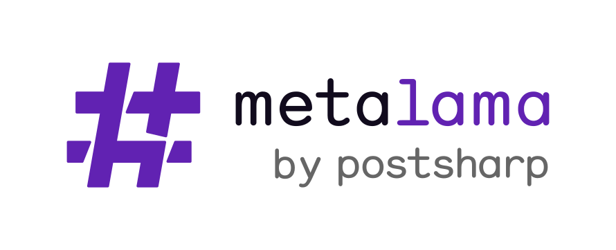

# Metalama



This repo is the home of Metalama, a modern Roslyn-based meta-programming framework to improve your code quality and productivity in C#. We use this repo for [discussions](https://github.com/postsharp/Metalama/discussions) and [bug reports](https://github.com/postsharp/Metalama/issues).

If you're new to Metalama, it's best to start with the [Metalama website](https://www.postsharp.net/metalama) or [documentation](https://doc.metalama.net/).

[](https://www.postsharp.net/slack) [](https://www.postsharp.net/discord)


## What is Metalama?

Metalama is a meta-programming framework for C#. It helps you improve your code quality and productivity.  With Metalama, you can:

* *Reduce boilerplate* by generating it dynamically during compilation. Your source code remains crystal-clear.
* *Verify code in real time* against architecture, patterns, and conventions. No need to wait for code reviews.
* *Provide coding assistance* to your team with customized feedback and suggestions.
* *Do it by your rules.* Automate your own implementation patterns and architecture guidelines.


## How does it work?

1. Add the `Metalama.Framework` package to your project.

2. Create an aspect class and write meta code that transforms the code using simple C#-based templates, report warnings and errors, or suggest code fixes. The aspect becomes the implementation of your patterns or architecture.

    Looking for an _Hello world_? Here is the traditional logging aspect:

    ```cs
    using Metalama.Framework.Aspects;
    
    public class LogAttribute : OverrideMethodAspect
    {
        public override dynamic? OverrideMethod()
        {
            Console.WriteLine( $"{meta.Target.Method} started." );
    
            try
            {
                var result = meta.Proceed();
    
                Console.WriteLine( $"{meta.Target.Method} succeeded." );
    
                return result;
            }
            catch ( Exception e )
            {
                Console.WriteLine( $"{meta.Target.Method} failed: {e.Message}." );
    
                throw;
            }
        }
    }
    ```

3. Tell your team to add the aspects to code using custom attributes, or add them in bulk compile-time C# code named fabrics.

4. You're done! When you run your app, it executes the code generated by your aspect but does not litter your source code. You now start seeing warnings and errors reported by the aspect. New generated methods are visible in Intellisense, and suggested refactorings are available in the lightbulb or screwdriver menu.


## Features

For a list of features, see https://www.postsharp.net/metalama.

## Repositories

Except for the core implementation of Metalama, many components are open source:


| Link                                                              | Description |
|-------------------------------------------------------------------|------------------------
| [Metalama.Documentation](https://github.com/postsharp/Metalama.Documentation) | Source code of the documentation published at https://doc.metalama.net/.
| [Metalama.Samples](https://github.com/postsharp/Metalama.Samples) | Several examples of increasing complexity. Best viewed online at https://doc.metalama.net/examples.
| [Metalama.Extensions](https://github.com/postsharp/Metalama.Extensions) | Fully supported and documented extensions to Metalama. 
| [Metalama.Community](https://github.com/postsharp/Metalama.Community) | A collection of aspects owned by the community.
| [Metalama.LinqPad](https://github.com/postsharp/Metalama.LinqPad) | A LinqPad driver that allows you to open and query any C# project or solution. 
| [PostSharp.Engineering](https://github.com/postsharp/PostSharp.Engineering) | Our continous build and integration toolset.
| [Metalama.Migration](https://github.com/postsharp/Metalama.Migration) | A documentation of the PostSharp API with instructions to migrate to Metalama.